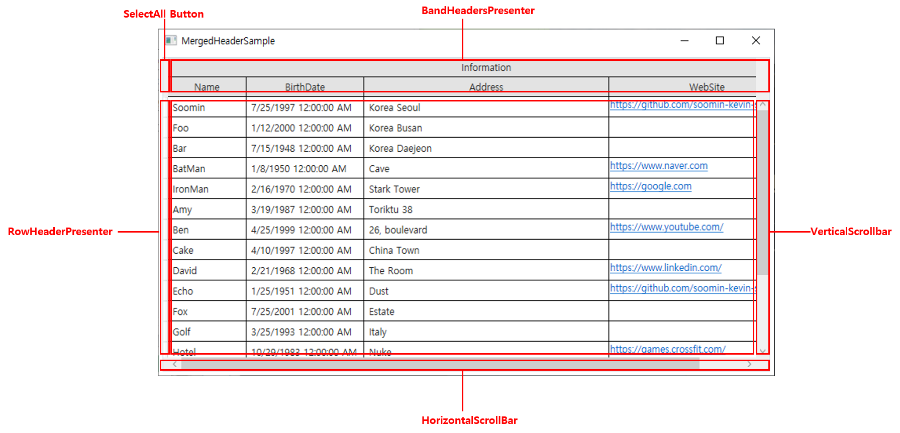
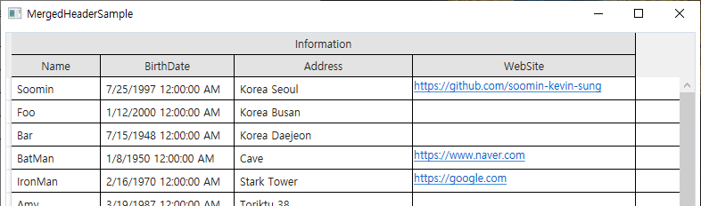
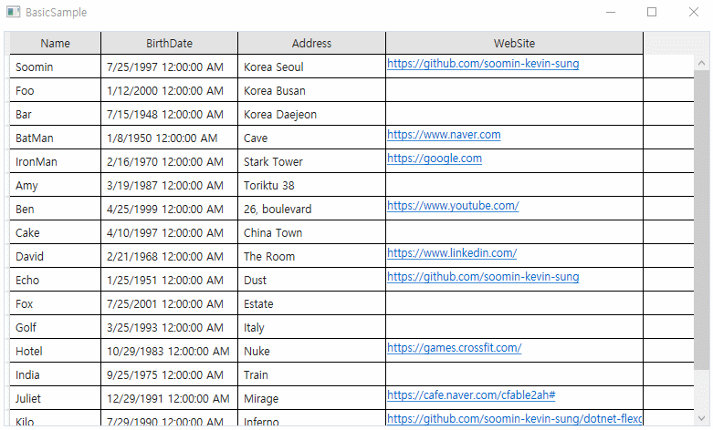
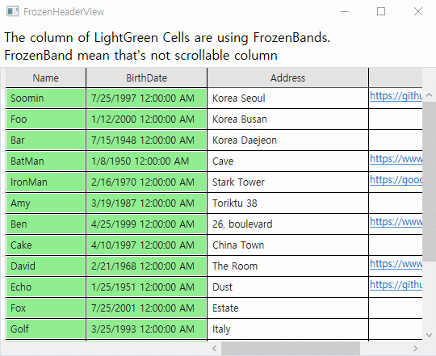
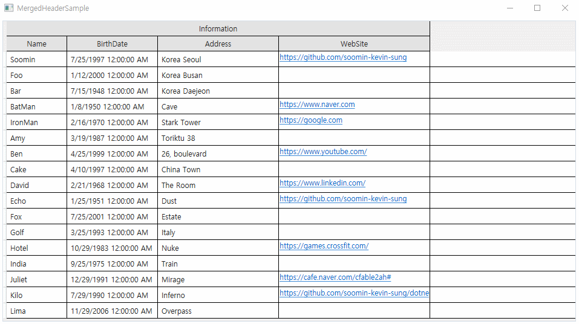
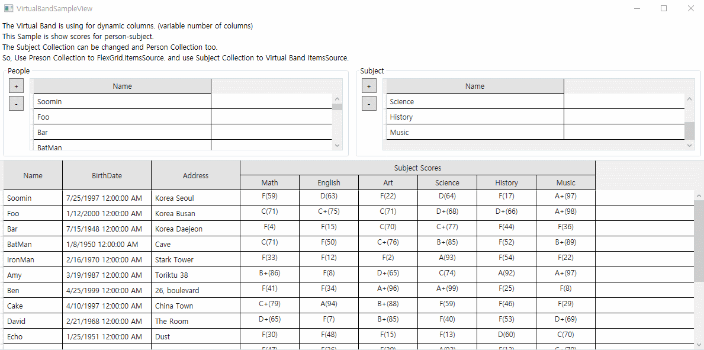
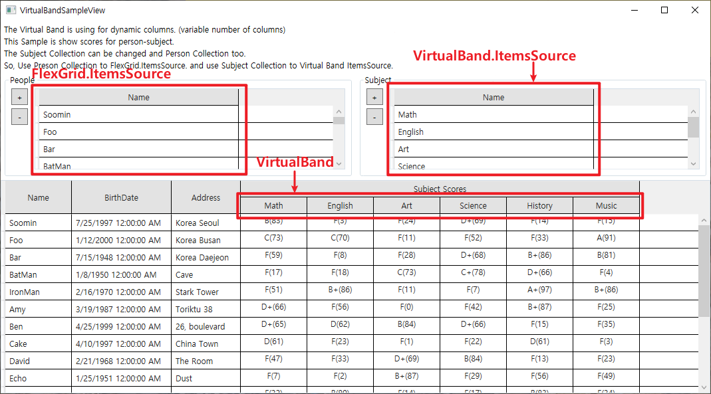

# FlexGrid

[](https://www.codefactor.io/repository/github/soomin-kevin-sung/dotnet-flexgrid/overview/master)&nbsp;
[](LICENSE.md)&nbsp;
&nbsp;
&nbsp;
&nbsp;

FlexGrid is a custom WPF DataGrid with convenient and useful features. When developing code using WPF, the Microsoft-supported DataGrid has limited functionality, such as nested and merged column headers and variable columns. However, with FlexGrid, your DataGrid development environment becomes significantly more convenient!

<br>

I'm proud to say that FlexGrid was fully built by me, and I'm excited to share it on GitHub :)

<br>

## Goal

- Create Customized DataGrid with convenient and useful features.
- Use FlexGrid to develop other WPF Programs

<br>

## Available Features

- [FlexGrid Template Structure](#flexgrid-template-structure)
- [Using Bands Instead Of Columns](#using-bands-instead-of-columns)
- [Bands and Frozen Bands](#bands-and-frozen-bands)
- [Mergable Column Header (Band.Bands)](#mergable-column-header-bandbands)
- [Variable Columns (VirtualBand)](#variable-columns-virtualband)

<br>

## Upcoming Features

- Background Color, BandHeader Color can modified by developers.

<br>

## FlexGrid Template Structure

FlexGrid is a Component that modified the Template of the default DataGrid.

<p align="center">
  
  <br>
  &lt;FlexGrid Template Structure&gt;
</p>

## Using Bands Instead Of Columns

FlexGrid uses BandHeadersPresenters to represent the columns. The BandHeaderPresenter represents the Bands in FlexGrid.FrozenBands and FlexGrid.Bands as Columns in the FlexGrid.

### Band Types

- TextBand
- CheckBoxBand
- ComboBoxBand
- TemplateBand
- VirtualBand
  - VirtualTextBand
  - VirtualCheckBoxBand
  - VirtualComboBoxBand
  - VirtualTemplateBand

This is Example how to use Bands.

```xml
<!-- xmlns:c="clr-namespace:KevinComponent;assembly=KevinComponent" -->

<c:FlexGrid>
  <!-- Here is start of code to add Bands. -->
  <c:FlexGrid.Bands>

    <!-- TextBand -->
    <c:TextBand
      Width="100"
      HorizontalAlignment="Center"
      Header="Name"
      TextBinding="{Binding Name}" />

    <!-- TemplateBand -->
    <c:TemplateBand Width="250" Header="WebSite">
      <c:TemplateBand.CellTemplate>
        <DataTemplate>
          <TextBlock>
            <Hyperlink
              NavigateUri="{Binding WebSite}"
              RequestNavigate="OnHyperlinkRequestNavigate">
              <TextBlock Text="{Binding WebSite}" />
            </Hyperlink>
          </TextBlock>
        </DataTemplate>
      </c:TemplateBand.CellTemplate>

      <c:TemplateBand.CellEditingTemplate>
        <DataTemplate>
          <TextBox Text="{Binding WebSite}" />
        </DataTemplate>
      </c:TemplateBand.CellEditingTemplate>
    </c:TemplateBand>

  </c:FlexGrid.Bands>
</c:FlexGrid>
```

<br>

## Bands and Frozen Bands

For represent Frozen Columns (Always showed Columns) in FlexGrid. You should use FlexGrid.FrozenBands.  
The FlexGrid shows to Bands in FlexGrid.FrozenBands as Frozen Columns.

This is Example Code how to use Frozen Bands.

```xml
<!-- xmlns:c="clr-namespace:KevinComponent;assembly=KevinComponent" -->

<c:FlexGrid>
  <!-- Here is start of code to add frozen bands. -->
  <c:FlexGrid.FrozenBands>

    <c:TextBand
      Width="100"
      HorizontalAlignment="Center"
      Header="Name"
      TextBinding="{Binding Name}" />

    <c:TextBand
      Width="150"
      HorizontalAlignment="Center"
      Header="BirthDate"
      TextBinding="{Binding BirthDate}" />

  </c:FlexGrid.FrozenBands>

  <!-- code to add default bands. -->
  <c:FlexGrid.Bands>

    <c:TextBand
      Width="200"
      Header="Address"
      TextBinding="{Binding Address}" />

  </c:FlexGrid.Bands>
</c:FlexGrid>
```

<br>

## Mergable Column Header (Band.Bands)

The Bands Property in Band can be used to represent Merged Column Headers.

<p align="center">
  
  <br>
  &lt;Merged Column Headers&gt;
</p>

Related Stack-overflow questions:  
* [Multilevel-column-header-for-datagrid-in-wpf](https://stackoverflow.com/questions/17652039/multilevel-column-header-for-datagrid-in-wpf)<br>
* [Wpf-datagrid-header-above-header](https://stackoverflow.com/questions/51440426/wpf-datagrid-header-above-header)<br>
* [Merge-header-columns-datagrid-wpf](https://stackoverflow.com/questions/6446684/merge-header-columns-datagrid-wpf)
<br><br>

This is Example Code how to use Band.Bands Object.

```xml
<!-- xmlns:c="clr-namespace:KevinComponent;assembly=KevinComponent" -->

<c:FlexGrid>
  <c:FlexGrid.Bands>

    <!-- Here is start of code to add root band. -->
    <c:TextBand Header="Information">
      <!-- code to add sub bands. -->
      <c:TextBand.Bands>

        <!-- TextBand -->
        <c:TextBand
          Width="100"
          HorizontalAlignment="Center"
          Header="Name"
          TextBinding="{Binding Name}" />

        <!-- TextBand -->
        <c:TextBand
          Width="150"
          HorizontalAlignment="Center"
          Header="BirthDate"
          TextBinding="{Binding BirthDate}" />

        <!-- TextBand -->
        <c:TextBand
          Width="200"
          Header="Address"
          TextBinding="{Binding Address}" />

        <!-- TemplateBand -->
        <c:TemplateBand Width="250" Header="WebSite">
          <c:TemplateBand.CellTemplate>
            <DataTemplate>
              <TextBlock>
                <Hyperlink NavigateUri="{Binding WebSite}" RequestNavigate="OnHyperlinkRequestNavigate">
                  <TextBlock Text="{Binding WebSite}" />
                </Hyperlink>
              </TextBlock>
            </DataTemplate>
          </c:TemplateBand.CellTemplate>

          <c:TemplateBand.CellEditingTemplate>
            <DataTemplate>
              <TextBox Text="{Binding WebSite}" />
            </DataTemplate>
          </c:TemplateBand.CellEditingTemplate>
        </c:TemplateBand>

      </c:TextBand.Bands>
    </c:TextBand>

  </c:FlexGrid.Bands>
</c:FlexGrid>
```

<br>

## Variable Columns (VirtualBand)

- (Writing Content...)

<br>

## Samples

### Basic Sample

<p align="center">
  
  <br>
  &lt;BasicSample ScreenShot&gt;
</p>

- **BasicSample** shows the basic usage of FlexGrid.<br>
- You can know how to use **FlexGrid** the basically in this sample.

<br>

### Frozen Header Sample

<p align="center">
  
  <br>
  &lt;FrozenHedaerSample ScreenShot&gt;
</p>

- FrozenHedaerSample shows how to using the frozen columns.<br>
- You can use **FlexGrid.FrozenBands** to add frozen columns.
- In this sample, the Name, BirthDate bands are Frozen Bands.

<br>

### Merged Header Sample

<p align="center">
  
  <br>
  &lt;MergedHedaerSample ScreenShot&gt;
</p>

- MergedHedaerSample shows how to merge column headers.<br>
- You can use **Band.Bands**(ex. TextBand.Bands, CheckBoxBand.Bands, etc.) to merge column headers.
- In this sample, you can see the Name, BirthDate, Address, and WebSite bands merged into the information band.

<br>

### VirtualBand Sample

<p align="center">
  
  <br>
  &lt;VirtualBandSample ScreenShot&gt;
</p>

- VirtualBandSample shows how variable columns are implemented in FlexGrid.<br>
- You can use **VirtualBand**(ex. VirtualTextBand, VirtualComboBoxBand, VirtualCheckBoxBand, etc.) to show variable columns.
- In this Sample, you can see that the list of subject scores synchronizes with the subject list when you edit the subject list.

<p align="center">
  
  <br>
  &lt;ItemsSource Description&gt;
</p>

<br>

## Support

If you have any good ideas (such as new featrue, refactoring, improvement feature quality, etc), do not hesitate to let me know!<br>
You also can "Pull request" or request adding New Feature to the email below.
Thank you.

- E-mail : ssm0725@gmail.com
